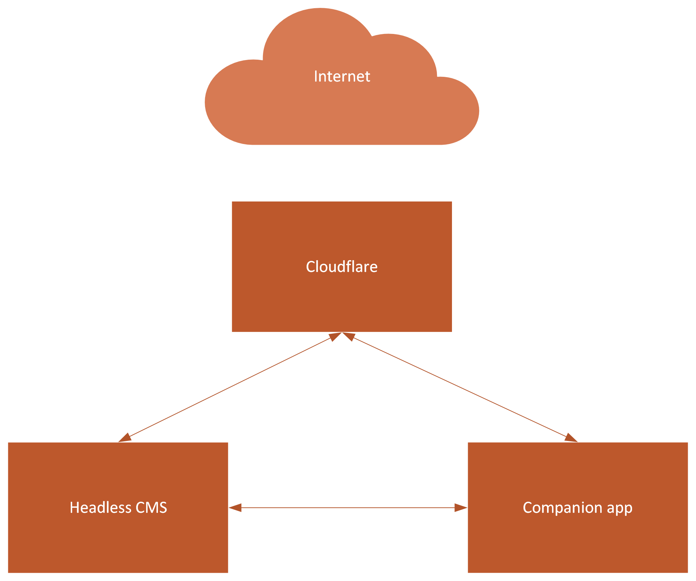

# JonDJones.CMS12.StarterKit  :heart_eyes: - By JONDJONES.COM

This is a .NET Core/.NET 5 Optimizely CMS 12 Starter kit.  Use this project to learn how to build enterprise-level projects using CMS 12.

Learn more about me from my website [www.jondjones.co.uk](www.jondjones.co.uk), or check subscribe to my [YouTube channel](https://studio.youtube.com/channel/UCc7FlFtsxY1gLxp1PFf-gqA).

This is an open-source repo.  If you would like to add something or correct a mistake, please open a PR.

:star: **Don't forget to star this app as it's updated frequently** :star:

## Live Site URL 👻

**Website URL**:
[http://cms12.jondjones.com/](http://cms12.jondjones.com/)

**Content Delivery API**:
[http://cms12.jondjones.com/api/episerver/v3.0/site/?language=en](http://cms12.jondjones.com/api/episerver/v3.0/site/?language=en)

## Headless

This starter kit also asa the content delivery API enabled in order to build a JAMStack website with Optimizely CMS.  A JAMStack repo example can be found here:

- [https://github.com/jondjones/JonDJones.OptimizelyCMS.V12.JamSTACK](https://github.com/jondjones/JonDJones.OptimizelyCMS.V12.JamSTACK)

The build process works via web hook.  Within `EventHandler.cs` a call is made to a webhook that triggers a JAMStack build.

## Getting Started :rocket:

1. Rstore DB from data folder
2. Login on `util/login` with :

|Password          | Email                      |
|------------------|----------------------------|
|P@55word          | jon@admin.com              |

## Architecture 😍

# Useful Links

- [https://github.com/episerver/content-delivery-js-sdk](https://github.com/episerver/content-delivery-js-sdk)